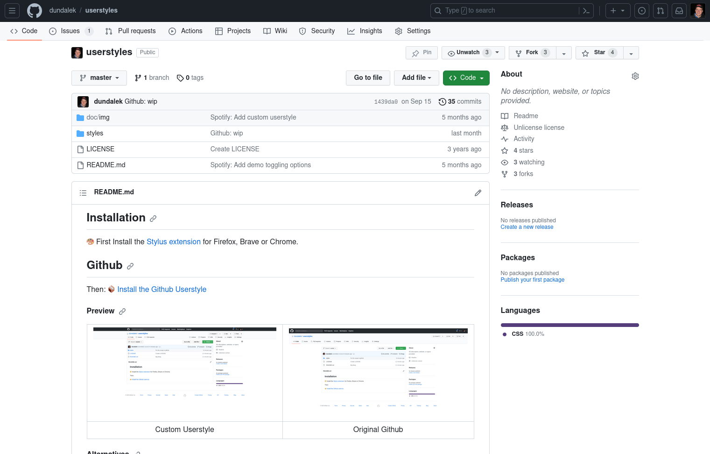
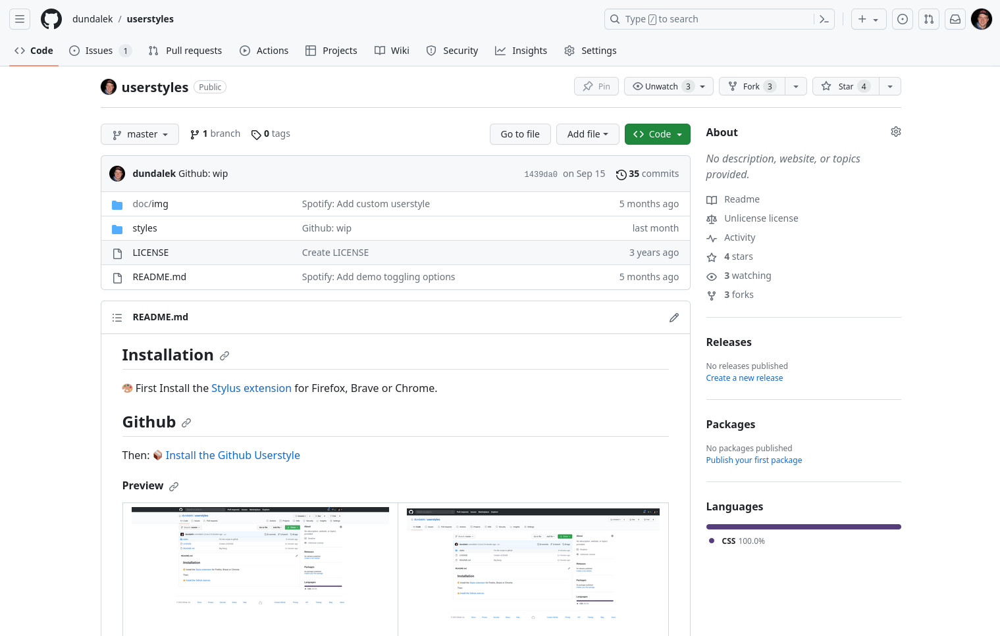
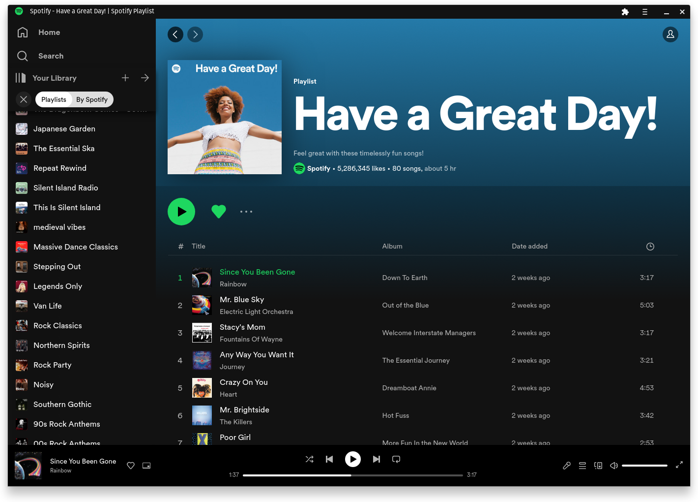
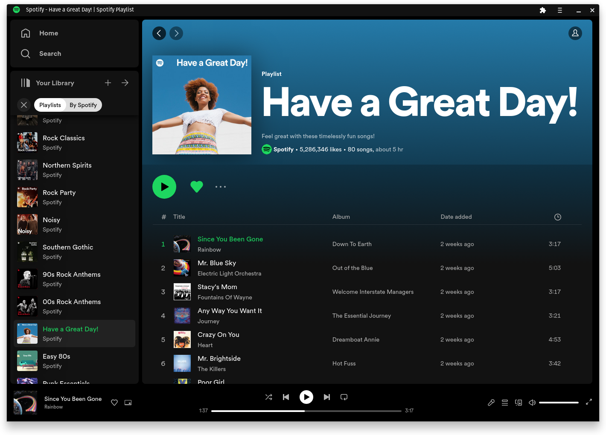

## Installation

🎨 First Install the [Stylus extension](https://github.com/openstyles/stylus#releases) for Firefox, Brave or Chrome.

## Github

Then: 📦 [Install the Github Userstyle](https://raw.githubusercontent.com/dundalek/userstyles/master/styles/github.user.css)

#### Preview

|  |  |
|:-:|:-:|
| Custom Userstyle | Original Github |

#### Alternatives

- https://gist.github.com/pushqrdx/b85a18717ac0b125705d4f9064f271cd
- https://github.com/ashwinvis/github-retro
- https://github.com/daattali/oldschool-github-extension

## Spotify

📦 [Install the Spotify Userstyle](https://raw.githubusercontent.com/dundalek/userstyles/master/styles/spotify.user.css)

Tweaks:
- Condensed Panels - removes rounded corner spacing between panels making it looks closer to older UI
- Condensed Sidebar - experimental, it may be buggy due to virtual scrolling. As an alternative there is also `Use compact library layout` option in Settings which achieves similar result (although it strips images).

#### Preview

|  |  |
|:-:|:-:|
| Custom Userstyle | Original Spotify Redesign |

#### Demo toggling options

https://github.com/dundalek/userstyles/assets/755611/c7843d50-d7f4-4fe7-8c0a-9e125bc888be
