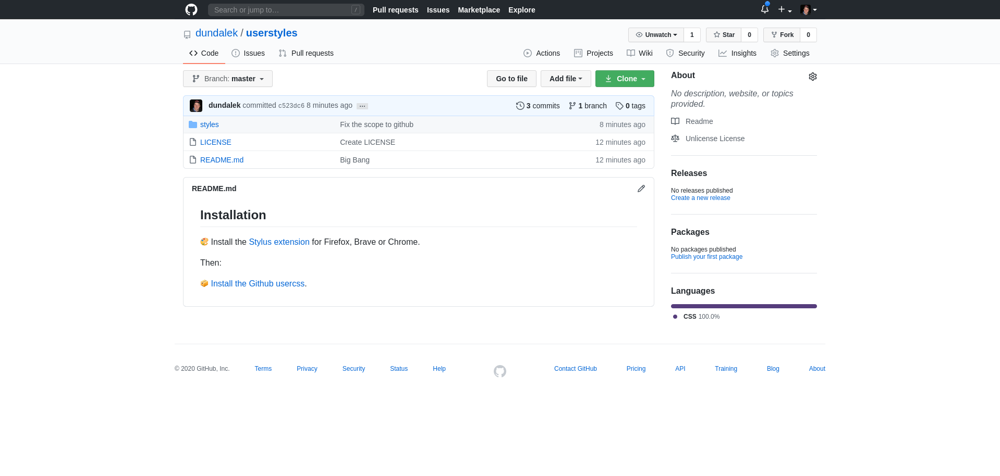
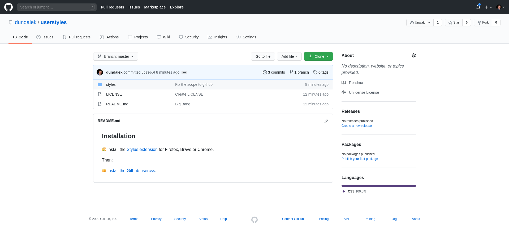

## Installation

🎨 Install the [Stylus extension](https://github.com/openstyles/stylus#releases) for Firefox, Brave or Chrome.

Then:

📦 [Install the Github usercss](https://raw.githubusercontent.com/dundalek/userstyles/master/styles/github.user.css).

### Custom Github

### Original Github

